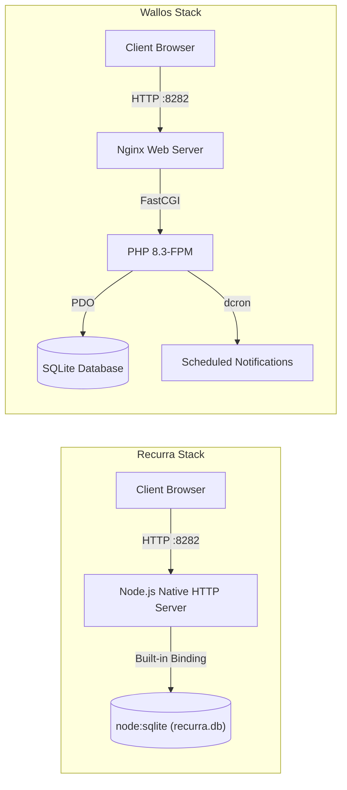

# 🛰️ Collate Fieldstation Research & Recurra

<div align="center">

[](recurra/LICENSE.md)
[](https://nodejs.org/)
[](https://nodejs.org/api/sqlite.html)
[]()
[](#-reference-engine-wallos)
[]()

**A comprehensive fieldstation research collation, architectural analysis, and zero-dependency implementation of a self-hosted recurring subscription tracker.**

</div>

---

## 📑 Table of Contents

- [Overview](#-overview)
- [Key Components](#-key-components)
  - [1. Recurra — Zero-Dependency Node.js Engine](#1-recurra--zero-dependency-nodejs-engine)
  - [2. Wallos — Reference Fieldstation Engine](#2-wallos--reference-fieldstation-engine)
- [Architectural Comparison](#-architectural-comparison)
- [Recurra Deep Dive & Getting Started](#-recurra-deep-dive--getting-started)
  - [Prerequisites](#prerequisites)
  - [Running Locally](#running-locally)
  - [Seeding Demo Data](#seeding-demo-data)
  - [Environment Configuration](#environment-configuration)
- [Wallos Reference Deployment](#-wallos-reference-deployment)
  - [Quickstart with Docker Compose](#quickstart-with-docker-compose)
- [REST API Reference (Recurra)](#-rest-api-reference-recurra)
- [Directory Structure](#-directory-structure)
- [Attribution & Upstream Credits](#-attribution--upstream-credits)
- [License](#-license)

---

## 📖 Overview

**Collate Fieldstation Research** investigates and builds modern, privacy-first, self-hostable service hubs ("Fieldstations"). 

In today's digital economy, managing subscriptions (streaming services, SaaS tools, cloud infrastructure, domain names, utility billing) typically forces users to entrust personal payment schedules and financial records to third-party cloud apps. 

This project explores two complementary solutions:
1. **Recurra**: A ground-up, zero-dependency recurring subscription and expense tracker crafted in modern Node.js using native `node:sqlite` and vanilla web standards.
2. **Wallos**: The reference open-source PHP 8.3 + SQLite containerized fieldstation engine used for architectural benchmarking and interaction analysis.

---

## 🧩 Key Components

### 1. Recurra — Zero-Dependency Node.js Engine
Located in [`recurra/`](recurra/), Recurra is engineered for speed, simplicity, and zero maintenance:
- **Zero External npm Dependencies**: Built purely on Node.js standard libraries (`node:http`, `node:sqlite`, `node:fs`, `node:path`). No massive `node_modules` tree required.
- **Embedded SQLite Storage**: Employs Node 22's built-in `DatabaseSync` (`node:sqlite`) with Write-Ahead Logging (`PRAGMA journal_mode = WAL`) and foreign key integrity.
- **Vanilla Frontend Architecture**: Clean HTML5, modular CSS, and reactive vanilla JavaScript providing instant UI response with zero build steps or bundling overhead.
- **Complete Subscription Lifecycle**: Manage monthly, quarterly, annual, and custom recurring intervals, renewal dates, payment methods, categories, and household members.
- **Visual Analytics & Reporting**: Real-time spending breakdowns, categorical pie charts, and annual cost estimations.

### 2. Wallos — Reference Fieldstation Engine
Located in [`wallos/`](wallos/), Wallos represents an established, community-vetted PHP/Docker implementation:
- Multi-currency conversions via live Fixer API feeds.
- Broad notification dispatching (Discord, Telegram, Pushover, Gotify, Email, Webhooks).
- Full OIDC (OpenID Connect) SSO support for Authelia, Authentik, Keycloak.
- Production container orchestration with PHP 8.3-FPM, Nginx, and dcron.

---

## ⚖️ Architectural Comparison

| Dimension | Recurra (`recurra/`) | Wallos (`wallos/`) |
| :--- | :--- | :--- |
| **Runtime** | Node.js (>= v22) | PHP 8.3-FPM |
| **Database** | Native `node:sqlite` (In-process) | SQLite 3 via PHP PDO |
| **External Dependencies** | **0** (Standard library only) | Bundled PHP libraries / Docker |
| **Web Server** | Native Node HTTP Server | Nginx Reverse Proxy |
| **Startup Speed** | Sub-second (< 100ms) | Container bootstrap |
| **Deployment** | Single command `npm start` | Docker Compose / Container |
| **Frontend Stack** | Vanilla JS, CSS3, HTML5 | Vanilla JS, CSS3, PHP layouts |
| **PWA / Mobile** | Responsive CSS Layout | Responsive CSS + Service Worker |



---

## ⚡ Recurra Deep Dive & Getting Started

### Prerequisites
- **Node.js**: Version 22.0.0 or higher (which includes native `node:sqlite`).

Check your Node.js version:
```bash
node -v
```

### Running Locally

```bash
# 1. Change directory to the recurra project
cd recurra

# 2. Start the server
npm start
# or:
node server.js
```

The application will start immediately:
```text
[recurra] Server listening on http://localhost:8282
[recurra] SQLite database connected: .../recurra/data/recurra.db
```

Open your browser and navigate to:
👉 **`http://localhost:8282`**

### Seeding Demo Data

To populate Recurra with realistic sample subscriptions, currencies, and categories:

```bash
node server.js --seed
```

### Development Mode (Auto-Reload)

To run with automatic file-watching on changes:

```bash
npm run dev
# or:
node --watch server.js
```

### Environment Configuration

Recurra can be customized using environment variables:

| Variable | Description | Default |
| :--- | :--- | :--- |
| `PORT` | HTTP server port | `8282` |
| `RECURRA_DB` | Absolute or relative path to SQLite database file | `./data/recurra.db` |

---

## 🐳 Wallos Reference Deployment

If you want to run or compare the reference Wallos implementation using Docker:

### Quickstart with Docker Compose

```bash
# Navigate to the wallos reference directory
cd wallos

# Spin up the container in the background
docker compose up -d
```

Access Wallos at:
👉 **`http://localhost:8282`**

To stop the container:
```bash
docker compose down
```

---

## 🔌 REST API Reference (Recurra)

Recurra provides a clean, predictable JSON REST API:

### Subscriptions
- `GET /api/subscriptions` — List all tracked subscriptions
- `POST /api/subscriptions` — Create a new subscription
- `GET /api/subscriptions/:id` — Retrieve a single subscription
- `PUT /api/subscriptions/:id` — Update subscription details
- `DELETE /api/subscriptions/:id` — Remove a subscription

### Metadata & Lookups
- `GET /api/categories` — List expense categories
- `POST /api/categories` — Create custom category
- `GET /api/currencies` — List configured currencies and exchange rates
- `POST /api/currencies` — Add currency
- `GET /api/members` — List household / team members
- `POST /api/members` — Add member
- `GET /api/payment-methods` — List payment methods (Credit Card, PayPal, etc.)
- `POST /api/payment-methods` — Add payment method

### Analytics & Summary
- `GET /api/stats` — Aggregate metrics (monthly total, yearly projected total, category breakdown)
- `GET /api/settings` — Current user & display preferences
- `PUT /api/settings` — Update settings

---

## 📂 Directory Structure

```text
collate-fieldstation-research/
├── .gitignore                   # Comprehensive ignores (node_modules, environments, OS files)
├── README.md                    # Detailed documentation and research guide
├── packages.json                # Project package descriptor
├── pages-lock.json              # Lockfile metadata
│
├── recurra/                     # Modern zero-dependency Node.js implementation
│   ├── package.json             # Recurra project scripts and metadata
│   ├── server.js                # Single-file Node.js server + SQLite backend
│   ├── LICENSE.md               # GPL-3.0 license
│   ├── data/                    # Persistent SQLite database directory (gitignored)
│   └── public/                  # Frontend single-page interface
│       ├── index.html           # Accessible semantic markup
│       ├── styles.css           # Modern CSS variables, dark/light themes
│       └── app.js               # Client-side state and async API interactions
│
└── wallos/                      # Reference PHP/Docker fieldstation implementation
    ├── Dockerfile               # Production container definition
    ├── docker-compose.yaml      # Docker Compose orchestration
    ├── nginx.conf               # Nginx server configuration
    ├── startup.sh               # Container entrypoint script
    ├── cronjobs                 # dcron task definitions
    ├── api/                     # Internal PHP APIs
    ├── db/                      # Database handlers and migrations
    ├── endpoints/               # Backend action endpoints
    ├── includes/                # Template partials and layouts
    ├── libs/                    # Helper libraries & integrations
    ├── scripts/                 # Client scripts
    ├── styles/                  # Theme stylesheets
    └── screenshots/             # UI showcase images
```

---

## 🤝 Attribution & Upstream Credits

- **Wallos**: The reference engine analyzed in this repository was created by [Miguel Ribeiro (ellite)](https://github.com/ellite/Wallos).
- **Recurra**: Reimplemented from scratch using Node.js built-ins and inspired by the UX and subscription management workflows pioneered by Wallos.

---

## 📄 License

This repository is licensed under the [GNU General Public License v3.0](recurra/LICENSE.md).
